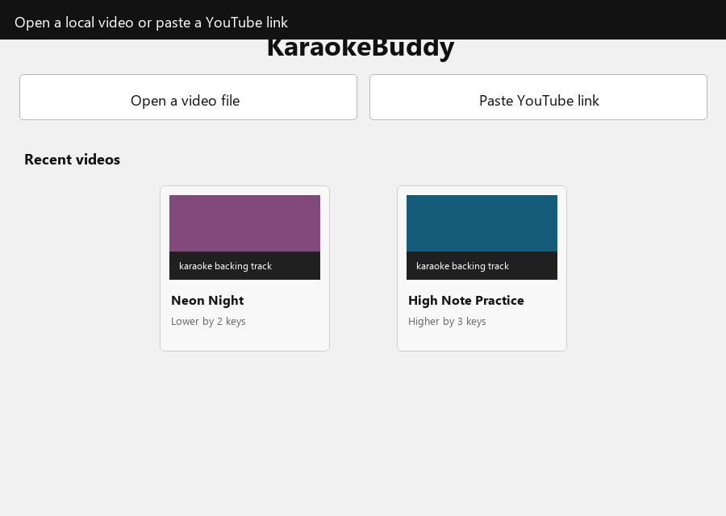
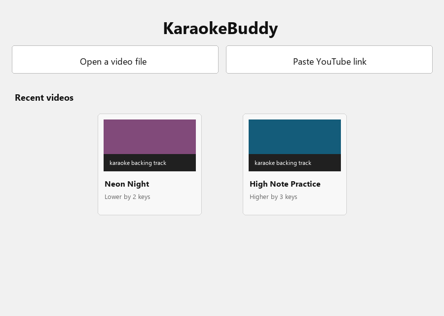
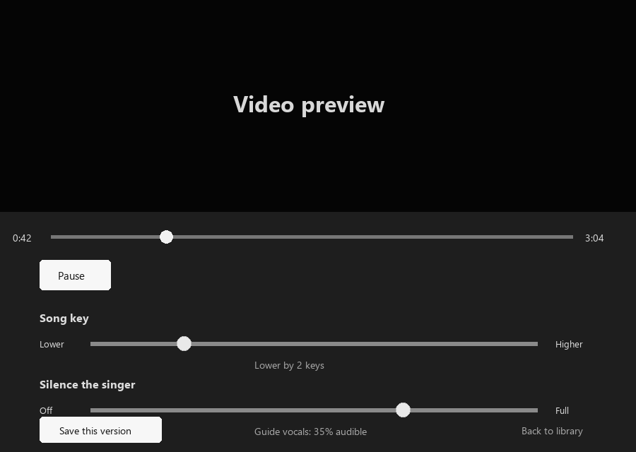
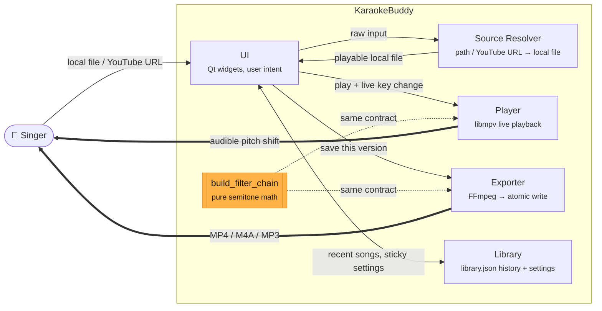

# KaraokeBuddy

> A portable desktop app for singers: open a karaoke video, shift the key while it plays, reduce guide vocals, and export a new MP4.



[](https://github.com/aayushman-singh/karaoke-buddy/actions/workflows/ci.yml)
[](LICENSE)
[](https://www.python.org/downloads/)
[](#platform-support)

KaraokeBuddy replaces a fiddly manual workflow - downloading a karaoke track, shifting audio in an editor, lining it back up with the video, and exporting again - with one focused app. It is built for a non-technical singer first: no DAW, no filter graph, no command line.

## What It Does

- Opens a local video file or downloads a YouTube karaoke video.
- Shifts pitch live in semitone steps without changing tempo.
- Reduces centered guide vocals live with a "Silence the singer" control — the same reduction you preview is baked into the export.
- Exports the current key (and vocal reduction) as a new MP4, or as audio only (`.m4a` / `.mp3`).
- Remembers recent songs, thumbnails, saved outputs, and per-song settings.
- Fails loudly when startup, source resolution, thumbnail generation, playback filtering, or export cannot complete, with logs written to `logs/app.log`.

| Home and library | Live playback controls |
| --- | --- |
|  |  |

## Download

**Windows:** download [KaraokeBuddy.exe v0.3.0](https://github.com/aayushman-singh/karaoke-buddy/releases/download/v0.3.0/KaraokeBuddy.exe), then double-click it.

The Windows release is a portable build: no installer, no admin rights, and no separate Python, FFmpeg, or mpv install.

Linux users can run from source. See [Quick Start](#quick-start).

## Try It In Your Browser

No download required. The **[live web demo](https://aayushman-singh.github.io/karaoke-buddy/demo/)** runs the core experience entirely in your browser: press play on a synthesized track, drag **Song key** to shift pitch without changing tempo, and drag **Silence the singer** to fade the centred lead vocal. Or tap **Match my key**, sing one note, and it detects your pitch from the mic and shifts the song to your range.

The browser preview uses [SoundTouch](https://github.com/cutterbl/SoundTouchJS) (a WSOLA pitch shifter, LGPL) inside a Web Audio AudioWorklet, so it demonstrates the experience rather than producing byte-identical output. The desktop app is the full engine — and it proves that what you preview is exactly what you export (see [Architecture](#architecture) and [Benchmarks](#benchmarks)).

## Quick Start

### Prerequisites

- Python 3.11 or newer
- FFmpeg and ffprobe on `PATH`
- libmpv on `PATH` (`libmpv-2.dll` on Windows, `libmpv.so` on Linux)

### Install And Run

```bash
git clone https://github.com/aayushman-singh/karaoke-buddy.git
cd karaoke-buddy
python -m venv .venv
.venv/Scripts/activate
pip install -e ".[dev]"
karaoke-buddy
```

You can also run it as a module:

```bash
python -m karaoke_buddy
```

KaraokeBuddy runs a dependency preflight before opening the UI. Missing FFmpeg, ffprobe, yt-dlp, Deno, or libmpv produces an explicit startup error instead of a traceback hidden in the terminal.

## Development

```bash
pip install -e ".[dev]"
ruff check .
ruff format --check .
pytest
```

Useful targeted checks:

```bash
# Boots the Qt main window for 250 ms, then exits.
python -m karaoke_buddy --smoke-check

# Runs the deterministic, dependency-light test surface used by CI.
pytest --ignore=tests/test_exporter.py

# Runs FFmpeg export integration tests when FFmpeg is available.
pytest tests/test_exporter.py -rs
```

## Test Strategy

The automated tests are worth keeping, but they are not pretending to be a full end-to-end media lab. The strongest coverage is around the code paths where regressions would be quiet and expensive:

- **Audio filter math:** example and property tests verify that semitone shifts map to the expected pitch scale and that both playback/export paths share the same transformation contract.
- **Source resolution:** tests cover YouTube URL detection, local-file resolution, cache hits, ffprobe parsing, and explicit failures for broken metadata/runtime paths.
- **Library persistence:** tests cover JSON round trips, atomic writes, ordering, saved outputs, and explicit failure for unreadable library files.
- **Dependency preflight:** tests check that missing or unloadable native pieces produce actionable startup errors.
- **Launch smoke:** a subprocess test imports the real Qt UI path and runs the event loop briefly with `QT_QPA_PLATFORM=offscreen`.

Known limits:

- FFmpeg export tests are local integration tests and are skipped when FFmpeg is not on `PATH`.
- The suite does not yet assert actual perceived audio quality after pitch shift or vocal reduction.
- UI behavior is smoke-tested, not exhaustively interaction-tested.

CI runs ruff plus the non-FFmpeg test surface on Python 3.11 and 3.12. Export verification remains local because it depends on the system FFmpeg build and available filters.

## Architecture

KaraokeBuddy keeps the system small: **five nodes** with narrow relations, plus one shared *contract* (the highlighted box — a pure function, not a sixth service) that two of them call. The headline is the dashed line below: one pure function owns the pitch-and-vocal math, and **both** the live Player and the Exporter consume it, so what you hear in preview is what lands in the file.



| Node | Owns | Why it exists |
| --- | --- | --- |
| UI | Qt widgets and user intent | Keeps the app understandable for non-technical singers. |
| Source Resolver | Local path or YouTube URL -> playable local file | Normalizes all inputs before playback/export. |
| Player | libmpv playback and live audio filter updates | Makes pitch changes audible immediately. |
| Exporter | FFmpeg subprocess and atomic MP4 write | Saves the same settings the user previewed. |
| Library | `library.json` history and sticky settings | Lets singers resume the song they were practicing. |

One pure function, `build_filter_chain(pitch, vocal_reduce)`, owns the FFmpeg audio filter math; its sibling `build_mpv_filter_chain(pitch, vocal_reduce)` emits the equivalent native-mpv filter (rubberband + a libavfilter `pan`) for live playback. Player and Exporter both consume that single contract, so preview and saved output stay aligned — for **both** the key shift and the vocal reduction. `tests/test_preview_export_equivalence.py` renders a known clip through both pipelines and asserts their spectra match for pitch *and* vocal reduction; a dedicated CI job installs rubberband-enabled FFmpeg + mpv and runs it as a required gate, so the claim is verified on every push, not just asserted.

The non-obvious design decisions behind this — why the browser demo uses
SoundTouch instead of `ffmpeg.wasm`, how preview≡export is proven, and why there
is no ML vocal isolation — are recorded as short ADRs in [`docs/adr/`](docs/adr/).

Runtime state is intentionally portable:

```text
KaraokeBuddy.exe
cache/                 downloaded YouTube videos and thumbnails
logs/app.log           rotating logs, 5 MB x 3
library.json           recent songs, settings, saved outputs

~/Videos/KaraokeBuddy/ default export folder
```

## Benchmarks

Two questions decide whether this tool feels good to a singer: does the key change feel **instant**, and does shifting the key **wreck the audio**. [`docs/benchmarks.md`](docs/benchmarks.md) documents how both are measured, with reproducible scripts under [`scripts/`](scripts/).

- **Browser-demo engine latency (measured, Chromium):** ~10 ms audio base latency at 48 kHz with a 2.67 ms render quantum; the slider-to-engine control path is ~0.2 ms. Pitch is shifted on the audio thread in an AudioWorklet.
- **Desktop slider→audible latency** and **PESQ/STOI pitch-shift quality:** methodology and repro scripts are published; the numbers come from a run on a machine with `ffmpeg` + `mpv` and an audio device (`scripts/bench_latency.py`, `scripts/bench_quality.py`). They are marked *pending hardware run* rather than estimated.
- **Pitch-scale mapping** (deterministic, real): a +N semitone shift applies a factor of `2^(N/12)` — e.g. +2 → 1.122462, +7 → 1.498307, ±12 → ×2 / ×0.5. Full table in the benchmarks doc.

## Build The Windows App

1. Drop these native binaries into `build/bin/`:
   - `ffmpeg.exe` with the `rubberband` filter
   - `ffprobe.exe` from the same FFmpeg build
   - `libmpv-2.dll`
2. Build:

   ```bash
   python build/build.py
   python build/build.py --onedir
   ```

3. Find the result in `build/dist/`.

Verify the packaged home screen:

```powershell
powershell -ExecutionPolicy Bypass -File build/verify_packaged_home.ps1
```

The verifier launches the packaged app, confirms the home window appears, and saves a screenshot to [docs/packaged-home.png](docs/packaged-home.png).

## Platform Support

- **Windows 11:** primary supported target and release artifact.
- **Linux:** source-run path is supported when FFmpeg, ffprobe, and libmpv are installed.
- **macOS:** not currently tested.

## Contributing

Issues and PRs are welcome. Read [CONTRIBUTING.md](CONTRIBUTING.md) before opening a PR.

Keep changes scoped, use Conventional Commits, and run:

```bash
ruff check --fix .
ruff format .
pytest --ignore=tests/test_exporter.py
```

## License

KaraokeBuddy source code is licensed under the [MIT License](LICENSE).

The Windows `.exe` bundles third-party binaries with their own licenses. See [NOTICE.md](NOTICE.md) for attribution.
